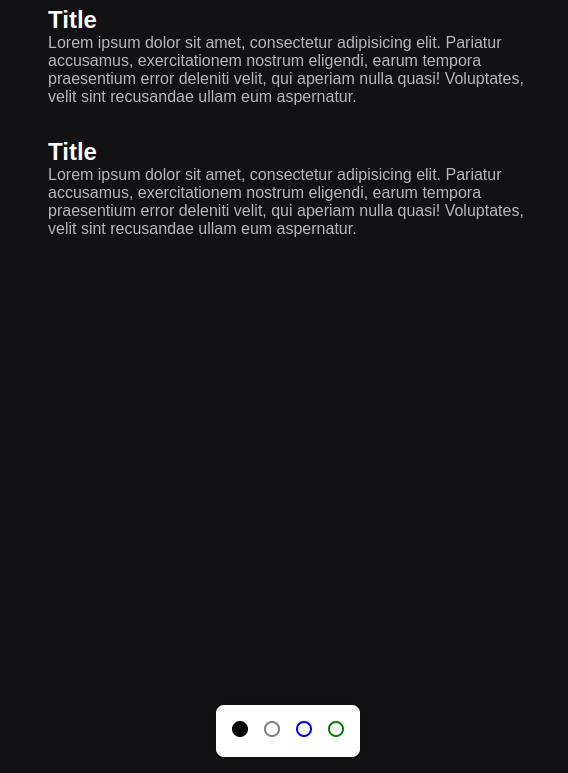
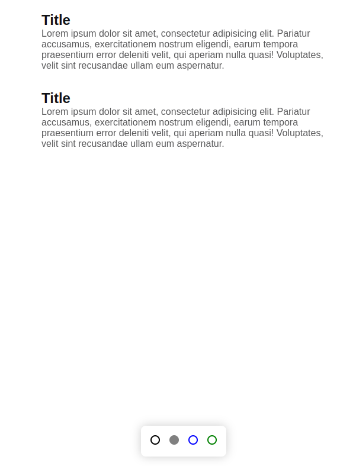
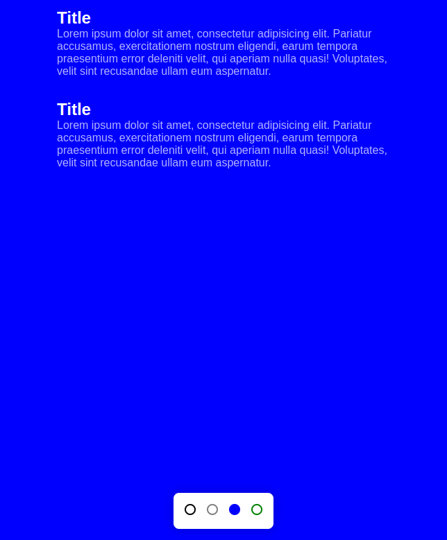
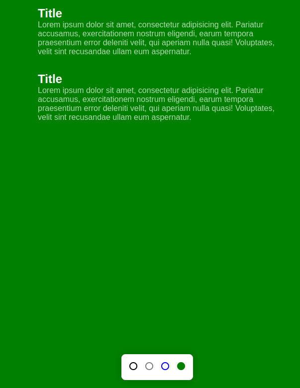

<h1 align="center"> Theme Change </h1>

 

## 🚀 Tecnologias

Esse projeto foi desenvolvido com as seguintes tecnologias:

- HTML e CSS
- JavaScript

 

 
<h3 align="center"> Theme Dark</h3>

 
  

 

<h3 align="center"> Theme Light </h3>

 
  

 

<h3 align="center">Theme Blue</h3>

 
  

 

<h3 align="center">Theme Green</h3>

 
  

 

## 💻 Projeto

O projeto foi desenvolvido pelo **Mayk Brito** e apresentado no canal da **Rocketseat**, tendo como objetivo apresentar a função **has** do css para realizar alteração de tema.
Foi aplicado o JS para realizar tal ação, pois nem todos os navegadores suporta a função (até o momento).